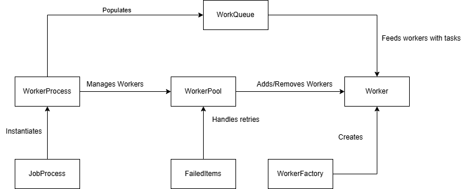

**Background Worker Process**

**The design of the background worker process is very simple. The worker
process maintains a thread safe queue of items. A worker pool is managed
by the worker process, so that tasks (workers) can be scaled up or down
depending on workload, max concurrency and scaling threshold. The worker
process can do item or batch processing. Developers can extend the functionality
by implementing the Worker class, adding methods to the JobProcess class, and adding conditions to the WorkerFactory class.
JobProcess can be injected as a singleton, or WorkerProcess can be instantiated directly in a local scope.**

**Patterns and principles**

**1. Factory Pattern (WorkerFactory)**

-   **Encapsulates object creation logic, ensuring separation of
    concerns.**

-   **Uses a switch expression to instantiate different worker types
    dynamically.**

-   **Prevents direct instantiation of workers, enforcing structured
    creation.**

**2. Worker Pool Pattern (WorkerPool)**

-   **Maintains a pool of worker threads, managing concurrency
    effectively.**

-   **Ensures that workers are dynamically added and removed based on
    load.**

-   **Implements a structured cancellation mechanism to gracefully shut
    down workers.**

**3. Queue-Based Processing (WorkQueue, \_failedItems)**

-   **Uses WorkQueue to distribute tasks asynchronously.**

-   **Failed work items are retried using a separate ConcurrentQueue,
    ensuring resilience.**

-   **Batched processing improves efficiency and prevents resource
    starvation.**

**4. Observer Pattern (Message Processing & Cursor Data Subscription)**

-   **ProcessQueueMessages() and ProcessCursorData() subscribe to
    external triggers.**

-   **Listens for new messages or cursor changes, processing them
    reactively.**

-   **Unsubscribes when processing completes, reducing unnecessary
    resource usage.**

**5. Retry Mechanism (RetryFailedItemsAsync())**

-   **Implements fault tolerance by retrying failed tasks up to
    \_retryLimit.**

-   **Logs retries and ensures structured execution before marking items
    as failed.**

-   **Balances reliability and performance by controlling the retry
    count.**

**6. Strategy Pattern (DistributeWorkAsync())**

-   **Allows dynamic selection of worker types, enabling flexible task
    distribution.**

-   **Supports different input sources, including batches, cursor-based
    data, and single items.**

-   **Ensures scalability by adjusting worker allocation dynamically.**

**7. Dependency Injection & Separation of Concerns**

-   **Dependencies like IDatabaseService, ILogger, and IQueueService are
    passed into constructors.**

-   **Enhances testability and decouples components for modular
    development.**

-   **Avoids tight coupling between different processing layers.**

**JobProcess Class Summary**

**The JobProcess class extends WorkerProcess and manages various job
types, including message processing, cursor-based data retrieval, and
user uploads.**

**Key Features**

-   **Message Processing: Subscribes to a queue service and distributes
    messages to workers.**

-   **Cursor-Based Data Handling: Fetches financial data using a
    Redis-backed CursorCache.**

-   **User Upload Processing: Retrieves uploaded user data and
    distributes it to worker threads.**

-   **Integration with External Services: Uses queue and trigger
    mechanisms for automated job execution.**

-   **Error Handling & Logging: Captures exceptions and provides
    structured logs.**

**Message Processing Breakdown**

1.  **Subscribes to queue messages:**

    -   **Registers a callback (processAction) that processes incoming
        messages.**

2.  **Distributes each message:**

    -   **Calls DistributeWorkAsync() to handle the workload.**

3.  **Handles errors gracefully:**

    -   **Catches cancellations and logs failures.**

4.  **Retries failed items:**

    -   **Ensures unprocessed messages get another attempt before
        unsubscribing.**

**Cursor-Based Data Handling**

1.  **Creates a CursorCache to track financial data requests.**

2.  **Registers an action:**

    -   **Calls DistributeWorkAsync() for paginated processing.**

3.  **Subscribes to triggers:**

    -   **Waits for external events (WaitForTrigger()).**

4.  **Unsubscribes upon completion.**

**User Upload Processing**

1.  **Fetches uploaded user data from the database.**

2.  **Distributes users for processing:**

    -   **Calls DistributeWorkAsync() to execute handling.**

**WorkerFactory Class Summary**

**The WorkerFactory class is responsible for dynamically creating worker
instances based on the requested type.**

**Key Features**

-   **Centralized Worker Creation: Simplifies worker instantiation
    through a factory method.**

-   **Type-Based Dispatching: Uses a switch expression to create
    appropriate worker types.**

-   **Exception Handling: Throws an ArgumentException for unknown worker
    types.**

-   **Dependency Injection Support: Passes necessary services
    (workQueue, databaseService, logger) to workers.**

**Worker Instantiation Breakdown**

1.  **Receives a worker type string.**

2.  **Uses a switch expression to determine the worker class:**

    -   **UserProcessingWorker → Handles user uploads.**

    -   **FinancialDataWorker → Processes financial data requests.**

    -   **MessageProcessingWorker → Manages incoming queue messages.**

    -   **If no matching type is found, an exception is thrown.**

3.  **Creates and returns the worker instance.**

    -   **Injects dependencies like workQueue, CancellationToken,
        databaseService, and logger.**

**Error Handling Mechanism**

-   **Throws an ArgumentException when the requested type does not match
    a known worker class.**

-   **Ensures that only valid worker instances are created, preventing
    runtime errors.**

**WorkerProcess Class Summary**

The WorkerProcess class manages the distribution of work items to worker
threads with dynamic scaling and retry mechanisms.

**Key Features**

-   **Work Item Management:** Maintains \_workQueue for active tasks and
    \_failedItems for retries.

-   **Worker Pool Management:** Allocates and manages worker threads
    efficiently.

-   **Dynamic Scaling:** Adjusts worker count based on
    \_scalingThreshold.

-   **Retry Mechanism:** Retries failed items up to \_retryLimit.

-   **Task Completion Handling:** Ensures all work items are processed
    before proceeding.

-   **Logging & Metrics:** Tracks system performance with structured
    logging.

**Scaling Mechanism Breakdown**

The class dynamically adjusts worker threads based on queue size:

1.  When adding items to \_workQueue, if the count reaches a multiple of
    \_scalingThreshold, it calls AdjustWorkerCount().

2.  AdjustWorkerCount() computes the optimal worker count using:

    -   targetWorkers = min(MaxConcurrency, max(1, queueSize /
        scalingThreshold))

    -   This ensures workers scale up when needed but don\'t exceed
        limits.

3.  Workers are added or removed dynamically via
    \_workerPool.AddWorker() and \_workerPool.RemoveWorker().

**Retry Logic Breakdown**

Retries failed work items through structured iterations:

1.  \_failedItems queue stores unprocessed work items.

2.  Retries happen up to \_retryLimit times:

    -   Items are dequeued and re-added to \_workQueue.

    -   WaitForCompletionAsync() ensures all tasks finish.

3.  If work still fails after max retries, logs indicate persistent
    failures.

**WorkerPool Class Summary**

The WorkerPool class manages a dynamic pool of worker threads, providing
concurrency control and fault tolerance.

**Key Features**

-   **Worker Management:** Uses \_workers to track active tasks and
    \_workerTokens for cancellation control.

-   **Dynamic Scaling:** Prevents exceeding MaxConcurrency while
    adding/removing workers.

-   **Performance Tracking:** Monitors \_totalItemsProcessed and logs
    failed work items.

-   **Graceful Shutdown:** Cancels all workers and optionally waits for
    completion.

-   **Task Completion Handling:** Ensures work finishes or stops upon
    cancellation.

**Scaling Mechanism Breakdown**

Workers are dynamically managed using AddWorker() and RemoveWorker():

1.  **Worker Addition:**

    -   Prevents exceeding MaxConcurrency.

    -   Instantiates a worker via WorkerFactory.CreateWorker().

    -   Runs the worker asynchronously (Task.Run()).

    -   Logs current worker count.

2.  **Worker Removal:**

    -   Cancels the first available worker via \_workerTokens.

    -   Removes the task from \_workers.

    -   Logs current count.

**Fault Tolerance & Retry Handling**

1.  **Failed items are collected:** \_failedItems stores work items that
    encountered errors.

2.  **Performance tracking:** ReportPerformance() logs success/failure.

3.  **Retries depend on dispatcher logic:** Items may be reprocessed.

**Shutdown Mechanism**

1.  Calls Shutdown(force), which:

    -   Cancels all worker tokens.

    -   Waits for completion unless force is specified.

**Worker Class Summary**

The Worker class is responsible for processing work items in a
structured manner with built-in cancellation and error handling
mechanisms.

**Key Features**

-   **Work Processing Loop:** Continuously retrieves and processes work
    items from workQueue.

-   **Idle Timeout Handling:** Ensures the worker doesn't run
    indefinitely without new tasks.

-   **Retry Limit:** Maximum of MaxRetries for handling failed work
    items.

-   **Performance Tracking:** Reports execution time and success/failure
    status.

-   **Exception Handling:** Catches errors and logs appropriate
    messages.

**Work Execution Flow**

1.  **StartAsync() manages work processing:**

    -   Runs in a loop, checking for available work.

    -   Calls ProcessItemAsync() when an item is found.

    -   Reports task execution time using Stopwatch.

2.  **Handles worker idle time:**

    -   Logs when no work is available.

    -   Cancels execution if idle timeout exceeds the threshold.

3.  **Processes work asynchronously:**

    -   Calls ProcessItemAsync() with simulated delays.

    -   Logs execution details.

**Error Handling Mechanism**

1.  **Cancellation Handling:**

    -   Throws OperationCanceledException when the token is triggered.

    -   Ensures workers shut down gracefully when requested.

2.  **General Exception Handling:**

    -   Logs unexpected errors.

    -   Reports failures using reportPerformance.
